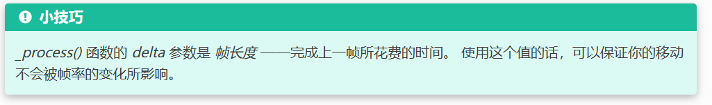

# 最简单的人物移动！
```gdscript
func _process(delta: float) -> void:
	var velocity = Vector2.ZERO # The player's movement vector.
	
	if Input.is_action_pressed("move_right"):
		velocity.x += 1
	if Input.is_action_pressed("move_left"):
		velocity.x -= 1
	if Input.is_action_pressed("move_down"):
		velocity.y += 1
	if Input.is_action_pressed("move_up"):
		velocity.y -= 1
		
	position.x +=delta*velocity.x*speed
	position.y +=delta*velocity.y*speed
	
	print(position)
	pass
```

<p style="font-size:20px;color:red;>">
当玩家同时按下两个方向键（如右+上）时，
<br>
速度向量会变成 (1, 1)，其实际移动速度是 √(1² + 1²) = √2 ≈ 1.414 倍。
<br>
这会导致斜向移动比水平/垂直移动快约 41%！</p>


假如我电脑垃圾 一秒1帧 你电脑好 一秒10帧
同样的一秒内 我的 delta 参数是1 你是0.1
因为我是1秒1帧 所以 最终结果1：``` 1 * 1 * 1=1```
你是1秒10帧  最终结果2：```1 * 10 * 0.1=1```
最终结果1=最终结果2， 所以使用delta 能保证垃圾电脑和好电脑操作反应是一样的，避免出现高Fps战神！
